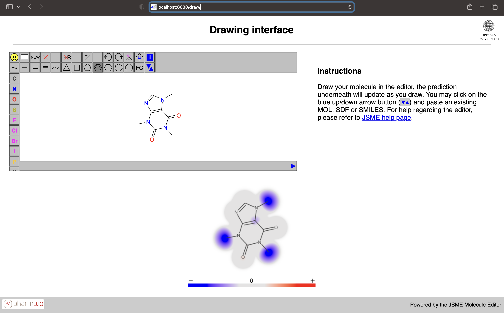
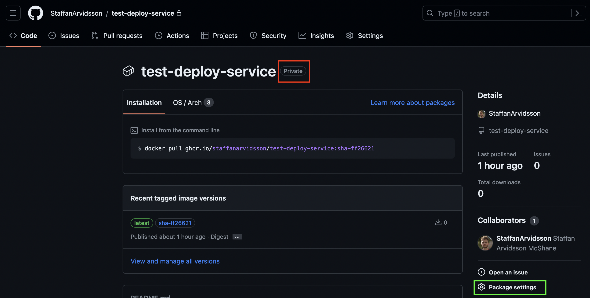
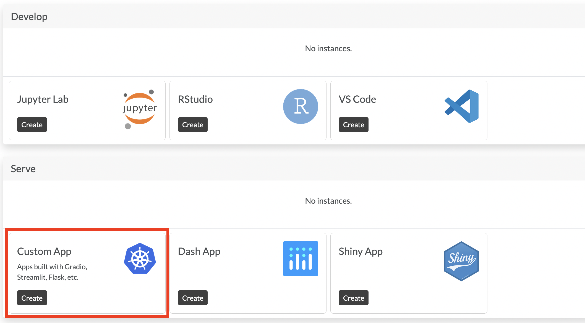
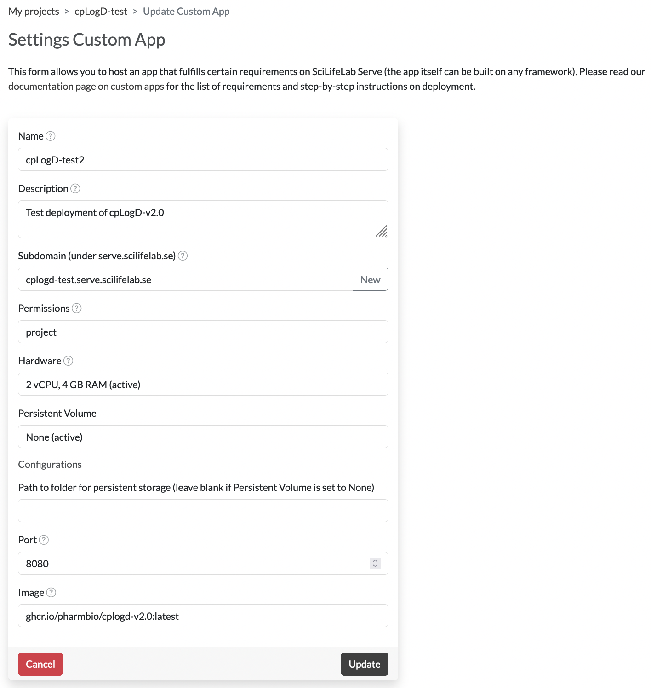

# Publish models

QSAR models built using CPSign can be published as web servers that can be interacted with using REST, and which are automatically documented using [OpenAPI](https://www.openapis.org/) specifications. The software required for this is located in a separate repository: [CPSign predict services](https://github.com/arosbio/cpsign_predict_services) which also contain more information. Here we first go through the basics of how these work and then detail the steps required to publish models at [SciLifeLab Serve](https://serve.scilifelab.se/). 

```{contents} Table of Contents
:depth: 2
```

## Introduction
The QSAR models, i.e., the ones that predicts directly on chemical compounds are possible to publish as web servers. These servers and models contain all meta information needed for computing descriptors and e.g. perform feature transformations. It is not possible to make non-QSAR models available with these servers at this point. These web servers are possible to build using two different *flavors*: either `thin` which only includes the java web server which can be interacted with using REST, or `full` which also include static files for serving the [Swagger UI](https://swagger.io/tools/swagger-ui/) for inspecting the OpenAPI specification of the REST endpoints and the `Draw UI` which looks like this:



In the `Draw UI` it is possible to input molecules in common chemical formats as well as draw/edit the molecules interactively - and get the predicted atom contributions rendered below the input window. Due to rapid prediction time this can be used interactively and will update as you edit the molecule.

## Deploying a model
Deploying a model is easily achieved using our prebuilt Docker images that can be found at GitHub Container repository: [CPSign predict services packages](https://github.com/orgs/arosbio/packages?repo_name=cpsign_predict_services). There is one image for each model type and deploying your own model and can easily be achieved by e.g. extending the image by simply copying the model you wish to deploy;

```Docker
# Pick the base image to use
FROM ghcr.io/arosbio/[IMAGE-NAME]:[TAG]
# Copy your model to the default model-path
COPY [MODEL-FILE] /var/lib/jetty/model.jar
```

If you build this into a Docker image you can then send it around, packaged with the model you wish to deploy. Building it and running it is as simple as (assuming you're in the same directory as the Dockerfile as well as the model you wish to deploy):

```Docker
docker build -t [YOUR TAG] .
```

Then you can run it using:

```bash
docker run -p 80:8080 -u jetty [YOUR TAG]
```

The web server is by default listening on port `8080` and in the above line we forward port `80` to `8080` so you can interact with it using your web browser without specifying a custom port. E.g. to check that it is running enter `localhost/api/v2/health` or `localhost/api/v2/modelInfo` in your browser.

#### Tags
Apart from the three different server types, which is dictated by the type of model you wish to deploy there are different tags depending on the *flavor* (See [Introduction](#introduction)). The tags with suffix `-full` includes the Swagger UI and the Draw UI, whereas the tags without the suffix are the more lightweight images that lack these additional resources. 

### Alternative ways to deploy using prebuilt images

Alternative ways to deploy a model can be to mount a volume into the container when starting it up and give the URI of the model as an environment variable. The environment variable `MODEL_FILE` can be set to use a custom location specifying where to read the model from. This URI can either be a local URI or a remote one that can be accessed from the container. A small example assuming that you have a conformal classification model in the current directory called `clf-model.jar` you can start up a server using:

```Docker
docker run -p 80:8080 \
    --name clf-model \
    --mount type=bind,source="$(pwd)",target=/app/data \
    --env MODEL_FILE=/app/data/clf-model.jar \
    ghcr.io/arosbio/cpsign-cp-clf-server:latest
```

In this example you mount your current directory (`source="$(pwd)"`) to the directory `/app/data/` inside the container - your `clf-model.jar` is thus located in `/app/data/clf-model.jar` - which we specify to `MODEL_URI` using the `--env` parameter. 


## Publish models at SciLifeLab Serve

This sections is a how-to-guide for how to publish models using the [SciLifeLab Serve](https://serve.scilifelab.se/) facility, mainly intended for researchers to e.g. publish models in connection with a published manuscript. To publish services at SciLifeLab you need to publish public Docker images at an online container repository, this guide details how this is done using the [GitHub docker registry](https://docs.github.com/en/packages/working-with-a-github-packages-registry/working-with-the-docker-registry). To follow this guide you need to have a public GitHub repository that your models and images can be connected to, this can either be a personal repository or one linked to an organization (e.g. https://github.com/pharmbio).


### 1. Build your Docker image

Building and publishing the Docker image can be achieved in two main ways; (1) building using GitHub actions (builds remotely), or (2) building locally and pushing the images to GitHub. The first way is easier but it requires the model file to be small enough that it can be saved within GitHub. For larger models that cannot be tracked with git, or in case you do not wish to save it within the repository, you should use option (2). 

### 1.1 Set up the Docker build

To publish your models at Serve they have two hard requirements;
- The container must run as user `1000`
- The container must have a start-up script called `start-script.sh` that should be used as entrypoint

Unfortunately these requirements forces the Docker build to be a bit more complex as the default user from the jetty base images is user `"jetty"` with id `999`. To comply with the requirements posed by Serve follow these steps:

1. Create a new directory in your repository that will serve as build directory for the Docker image. 
2. Place your model that you want to deploy in the build directory. 
3. Download and place the [Dockerfile](extras/Dockerfile) in your build directory. You need to replace all values inside square brackets, the ones starting with `[OPTIONAL ` can be removed. **Note:** the `[SERVER-TYPE]` must match with your model type, see available types at [CPSign predict services](https://github.com/orgs/arosbio/packages?repo_name=cpsign_predict_services). In case you want to serve the Swagger UI and [Draw UI](#introduction) as part of your service, specify a tag with a `-full` suffix. For an example of a complete Dockerfile look at our example project [cpLogD-v2.0 Dockerfile](https://github.com/pharmbio/cplogd-v2.0/blob/main/generate_service/Dockerfile). **Note:** the line `LABEL org.opencontainers.image.source=[URL TO YOUR GITHUB REPO]` is **required** for GitHub to be able to link the images to your own repository. 
4. Download the [start-script.sh](extras/start-script.sh) and place it in your build directory (you do not have to make any updates to it). 

Now it is time to build the image, either follow [build remotely](#12-build-image-remotely-on-github) or [build locally](#12-build-image-locally).

### 1.2 Build image *remotely* on GitHub

**Note:** Your model file must be smaller than GitHub file size limits (giving warnings for files larger than 50MB and blocks files larger than 100MB).

To build your docker image remotely you create a github action by adding a yaml file in the directory `.github/workflows` (from the repository root), you can download and use the [publish-docker-image.yaml](extras/publish-docker-image.yaml) file as a starting point and update the values marked with `[TODO: ]`. This workflow will be triggered automatically for a push event in branches `main` and `master` or you can manually trigger it in GitHub. Especially note the environment variables that you set on lines 22 and 23, which should be the relative path to the Dockerfile from the repository root and the build directory which you created above. E.g. if your build directory is called `build_dir` and you used the standard `Dockerfile` name for your dockerfile these would be `DOCKER_FILE: build_dir/Dockerfile` and `working-directory: build_dir`. 

Once you have pushed the workflow file and the contents of your build directory from the previous step your docker image will be built on GitHub servers and you should find it under the `Packages` in your GitHub repository web page. To verify that it is working as it should, run the following (replace `ghcr.io/org/repo:latest` with the correct tag for your image):

```bash
docker pull ghcr.io/org/repo:latest
docker run -p 80:8080 --name test-server ghcr.io/org/repo:latest
```

This should now start up your model in your local computer and you can verify that it is working by e.g. going to `localhost/api/v2/modelInfo` in your web browser to see that it returns a JSON with modelName and version information. If this worked you are now ready to move over to the next step to [make it public](#13-make-your-image-public).


### 1.2 Build image *locally*

Here you do not have to push the contents of your docker build directory to GitHub. This step requires that you have [Docker desktop](https://www.docker.com/products/docker-desktop/) installed as well as the [Buildx](https://github.com/docker/buildx) extension (that may come with the Docker desktop installation, depending on your installation). With Buildx you can cross-compile docker images for several platforms and architectures, so more users can utilize your docker image. 

**Follow these steps:**

1. **Create a security token for GitHub.**
    To push the built images you need to authenticate yourself to GitHub in your terminal session. To do this you have to create an authentication token. At this point only `Personal access token (classic)` is supported for interaction with the Docker repository, follow [these steps to create such a token](https://docs.github.com/en/authentication/keeping-your-account-and-data-secure/managing-your-personal-access-tokens#creating-a-personal-access-token-classic). 
2. **Authenticate to GitHub.** Here you use your token in order to authenticate to GitHub in your current terminal session, this can be done using e.g.:
    ```bash
    # Save token in CR_TOKEN
    export CR_TOKEN=[your token]
    # Login
    echo $CR_PAT | docker login ghcr.io -u [USERNAME] --password-stdin
    > Login successful
    ```

    Note that these are subject to change, so for more information read the current documentation at [GitHub documentation](https://docs.github.com/en/packages/working-with-a-github-packages-registry/working-with-the-container-registry#authenticating-with-a-personal-access-token-classic) (or other relevant information in case their recommended workflow changes).
        
3. **Create a Buildx builder instance.** This is needed for the subsequent docker build.
    ```bash
    docker buildx create --name mybuilder --use
    # optionally print stats about the builders
    docker buildx inspect --bootstrap
    ```

3. **Build the image**. Build the image using `docker buildx build` from your build directory in your terminal. Use the `--platform` argument to specify which architectures to build for. SciLifeLab Serve are running their services on a linux `x86_64` architecture, meaning we at least have to specify `linux/amd64` but to test it on e.g. a Mac Apple Silicon chip you can use the `linux/arm64` platform. Update the following by replacing the `[USER | ORGANIZATION]` and `[REPOSITORY]` so it matches your repository. Add an appropriate `[TAG]` for the image, or use `latest`. 

    ```bash
    docker buildx build \
        --platform linux/amd64,linux/arm64 \
        -t ghcr.io/[USER | ORGANIZATION]/[REPOSITORY]:[TAG] \
        . --push
    ```
    For example, for our example service [cpLogD-v2.0](https://github.com/pharmbio/cplogd-v2.0) the repository is called `cplogd-v2.0` and the organization it belongs to is called `pharmbio` so the tag should thus be `ghcr.io/pharmbio/cplogd-v2.0:latest`. 

    This call will automatically push the built image(s) to your repository due to the last `--push` flag. Now you should be able to view the generated image under `Packages` in your GitHub repository web page. To verify that it is working as it should, run the following (replace `ghcr.io/org/repo:latest` with the correct tag for your image):

    ```bash
    docker pull ghcr.io/org/repo:latest
    docker run -p 80:8080 --name test-server ghcr.io/org/repo:latest
    ```

    This should now start up your model in your local computer and you can verify that it is working by e.g. going to `localhost/api/v2/modelInfo` in your web browser to see that it returns a JSON with modelName and version information. If this worked you can now move on to the next step. 


### 1.3 Make your image public
At this point you should have a docker image packaged with your model and available through GitHub container repository. To publish it at Serve you have to make sure that its visibility is set to public (so anyone can pull it from GitHub). By default the image will be private (red square):



To change visibility go to `Package settings` (neon green square) in the lower right in the image. Scroll down to the `Danger Zone` and press `Change visibility` and pick `Public`. If your repository is part of an organization or if you do not have sufficient privileges you may not be allowed to change it to public, in which case you have to get help to make this change for you. Going back to package page (image above) the `Private` text next to the image name should be gone. 


### 2 Deploy service at SciLifeLab Serve
Now you should have a publicly available docker image that is ready to publish. Here we detail how to do so in SciLifeLab Serve.

-  **Create an account at Serve.** You need to [create an account](https://serve.scilifelab.se/docs/user-accounts/) at SciLifeLab Serve following their guide. This is free of charge for life science researchers affiliated with Swedish research institutions. 

- **Create a Serve project.** Login to your account and create a new by pressing `+ New project` -> pick `Default project`. Give it a name and a description.

- **Create an App.** In your project you should now create a `Custom App` under the `Serve` section (highlighted section in the image below).

    

- **Configure it.** Here you can give it a name, set permissions (visibility), give it a specific subdomain to use etc. This could look something like this:
    
    Note that you must set the `Port` to `8080` as that is the port exposed in the Docker container. The Serve infrastructure will forward the normal HTTP port (80) to the port exposed in the container. You do not need a Persistent Volume as everything is contained within the docker image. It will take a little while for the service to start up, once the status is "Running" you should be able to press the name and go to the URL of the service (`<your subdomain>.serve.scilifelab.se`). This URL will be a Jetty backup-page unless you specified a tag with a `-full` suffix when writing your Dockerfile in step 1 above. If you add `/api/v2/modelInfo` after this URL (i.e., `<your subdomain>.serve.scilifelab.se/api/v2/modelInfo`) you should get the same information as when you tested it on your local machine.


**Now you should successfully have published your model!**


